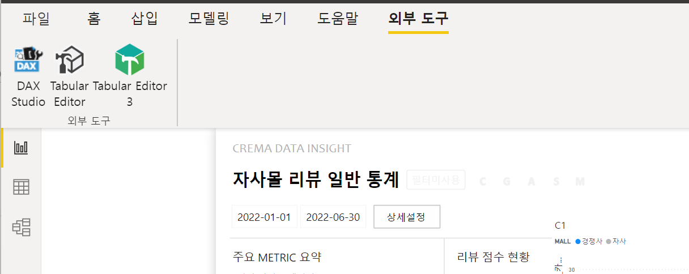

# Tabular Editor Calculation Group 활용 방안

## 계산 그룹이란?

-측정값 모음

[공식페이지](https://learn.microsoft.com/ko-kr/analysis-services/tabular-models/calculation-groups?view=asallproducts-allversions) 설명을 참고 부탁드립니다.

**생성::** **타블로 에디터에서 생성** (에디터 설치 후 power BI 재실행 시 외부도구에서 확인)

>에디터 다운로드페이지
[https://www.sqlbi.com/tools/tabular-editor/](https://www.sqlbi.com/tools/tabular-editor/)



타블로 에디터 실행 시 Tables에서 power BI에 연결된 데이터셋을 확인 가능


Tables에서 오른쪽 클릭 후 계산 그룹 생성


 Calculation Items에서 오른쪽 클릭 후 아이템 생성

(아이템이 각 계산식)


오른쪽 상단에 dax 코드 입력, 오른쪽 하단에 측정값 이름과 Order 번호 입력


**계산그룹 dax 코드 형식**(일반 형식과 거의 유사 )

SELECTEDMEASURE 랑 FILTER에 들어가는 테이블은 같아야됨.

```jsx
calculate(
SELECTEDMEASURE(),     ###이 부분이 기본 dax코드와 다름, power BI 에서 적용할 코드를 selectedmeasure() 로 대체
filter(...)
)
```

>계산그룹에서 사용하는 dax코드로 ‘selectedmeasure’ 말고도 몇 개 더 있습니다.

dax 작성 후 이미지 오른쪽 하단 체크 아이콘 클릭 후 ctrl+s 하면 power BI에 적용됨


power BI 상에는 테이블로 생성


### 계산 그룹의 장점

측정값 식을 그룹화하여 중복 측정값 수를 줄여 복잡한 식을 간소화

가상테이블에서 필드 적용 필터가 동일하게 적용됨

변경 적용 용이

### 예상되는 업무 효율 증가 부분

전체 dax에 영향이 있을 경우 계산 그룹만 수정하여 빠른 적용 가능

코드 해석이 용이하여 다른 작업자도 쉽게 코드 숙지 가능

기본 코드만 생성 후, 각각의 계산 그룹 필터만 필요에 따라 생성, 사용하여 빠른 dax코드 작성 가능 

# **실 사용 예제_DI-리뷰자연어**

- DI리뷰자연어 대시보드에서 적용이 필요한 부분
    
    2:3페이지 카테고리 필터 추가할때 DT_E_PRODUCT_INFO 에 카테고리 열 추가(전처리 시 적용) 필요
    DT_E_MALLID와 DT_E_PRODUCT_INFO가 관계가 없지만 mallid 컬럼으로 연결 예정,
    연결 시 기존 FT_E_PRODUCT_KEYWORD와 DT_E_MALLID 의 관계는 비활성화 처리해야 하는데 그렇게 하면 기존 dax 가상테이블(몰 매출 세그먼트 생성)에 영향을 끼쳐 잘못된 값으로 연산됨
    
    해결방안 > 가상테이블 사용 dax코드는 수정 불가피해 보여, 가상테이블을 사용하는 전체 코드 수정이 필요함
    
    1. DT_E_MALLID와 DT_E_PRODUCT_INFO를 비활성화 관계 설정 > 카테고리 필터 적용 시 관계 활성화 되도록 dax코드에  userelationship 코드 추가
    2. DT_E_MALLID와 FT_E_PRODUCT_KEYWORD를 비활성화 관계 설정> 가상테이블 사용 시 관계 활성화 되도록 dax코드에  userelationship 코드 추가
    
    powerBI관계도
    
    
    

>매출 세그먼트는 디멘션테이블이 있지만 연산은 가상테이블에서 하기 때문에 다양한 필터가 적용될 시 측정값이 아주 복잡해짐

>mallid 필터(매출세그먼트 가상테이블)와 date필터는 중복 사용되어 계산그룹을 생성해 측정값 간소화 및 차트에는 단일코드 사용 

### 하단 차트 설명

메인 측정값에 적용될 필터(관계설정 변동 없음):

1. 키워드/리뷰 필터
2. 매출 세그먼트 행필터
3. 자사몰/경쟁사 범례필터
4. 몰아이디 필터

경쟁사 매출 세그먼트 별 키워드 수(mallid_pid기준), 자사가 어느 구간에 속하는 지와 수량을 그래프로 경쟁사와 비교할 수 있도록 함


# DAX코드 예시

>dax코드는 power BI에서 작성한 코드와 Tabular Editor에서 작성한 코드로 되어 있습니다.

## power BI DAX

- **생성 예시**
    
    
    

**차트에 사용한 측정값 코드**

- 차트코드
    
    ```jsx
    P1_C1_평균키워드리뷰_카운트 = 
    
    SWITCH(TRUE(),
    SELECTEDVALUE('DT_E_REVIEW_TYPE'[type])="키워드수",
        switch(true(),
        SELECTEDVALUE('DT_E_MALL_SELECT'[MALL])="경쟁사",
        divide([CG_키워드카운트],[CG_키워드몰프로덕트카운트]),
        SELECTEDVALUE('DT_E_MALL_SELECT'[MALL])="자사",
        divide([CG_키워드카운트_자사2],[CG_키워드몰프로덕트카운트_자사2])),
    SELECTEDVALUE('DT_E_REVIEW_TYPE'[type])="리뷰수",
     divide([CG_리뷰카운트],[CG_리뷰몰프로덕트카운트]))
    ```
    
    리뷰수/키워드수 필터선택으로 값이 바뀌고 범례 필터를 적용하도록 내부 switch 추가
    

**계산그룹 이름은 ‘CG’로 시작되도록 작성한 상태**

- 계산그룹 코드
    
    ```jsx
    --경쟁사_계산그룹필터_몰_날짜
    
    CG_키워드카운트 = 
    switch(true(),
    	SELECTEDVALUE('DT_E_CATEGORY_SALES_FILTER'[segment])="2억 미만",
    	calculate([FT_E_PRODUCT_KEYWORD키워드수],'CG_FT_E_PRODUCT_KEYWORD_MALL_FILTER'[Name]="2억 미만",'CG_DATE_FILTERS'[Name]="FT_E_PRODUCT_KEYWORD_DATE"),
    	SELECTEDVALUE('DT_E_CATEGORY_SALES_FILTER'[segment])="2-4억 사이",
    	calculate([FT_E_PRODUCT_KEYWORD키워드수],'CG_FT_E_PRODUCT_KEYWORD_MALL_FILTER'[Name]="2-4억 사이",'CG_DATE_FILTERS'[Name]="FT_E_PRODUCT_KEYWORD_DATE"),
    	SELECTEDVALUE('DT_E_CATEGORY_SALES_FILTER'[segment])="4-7억 사이",
    	calculate([FT_E_PRODUCT_KEYWORD키워드수],'CG_FT_E_PRODUCT_KEYWORD_MALL_FILTER'[Name]="4-7억 사이",'CG_DATE_FILTERS'[Name]="FT_E_PRODUCT_KEYWORD_DATE"),
    	SELECTEDVALUE('DT_E_CATEGORY_SALES_FILTER'[segment])="7-10억 사이",
    	calculate([FT_E_PRODUCT_KEYWORD키워드수],'CG_FT_E_PRODUCT_KEYWORD_MALL_FILTER'[Name]="7-10억 사이",'CG_DATE_FILTERS'[Name]="FT_E_PRODUCT_KEYWORD_DATE"),
    	SELECTEDVALUE('DT_E_CATEGORY_SALES_FILTER'[segment])="10억 이상",
    	calculate([FT_E_PRODUCT_KEYWORD키워드수],'CG_FT_E_PRODUCT_KEYWORD_MALL_FILTER'[Name]="10억 이상",'CG_DATE_FILTERS'[Name]="FT_E_PRODUCT_KEYWORD_DATE")
    )
    
    CG_키워드몰프로덕트카운트 = 
    switch(true(),
    	SELECTEDVALUE('DT_E_CATEGORY_SALES_FILTER'[segment])="2억 미만",
    	calculate([FT_E_PRODUCT_KEYWORD키워드몰프로덕트수],'CG_FT_E_PRODUCT_KEYWORD_MALL_FILTER'[Name]="2억 미만",'CG_DATE_FILTERS'[Name]="FT_E_PRODUCT_KEYWORD_DATE"),
    	SELECTEDVALUE('DT_E_CATEGORY_SALES_FILTER'[segment])="2-4억 사이",
    	calculate([FT_E_PRODUCT_KEYWORD키워드몰프로덕트수],'CG_FT_E_PRODUCT_KEYWORD_MALL_FILTER'[Name]="2-4억 사이",'CG_DATE_FILTERS'[Name]="FT_E_PRODUCT_KEYWORD_DATE"),
    	SELECTEDVALUE('DT_E_CATEGORY_SALES_FILTER'[segment])="4-7억 사이",
    	calculate([FT_E_PRODUCT_KEYWORD키워드몰프로덕트수],'CG_FT_E_PRODUCT_KEYWORD_MALL_FILTER'[Name]="4-7억 사이",'CG_DATE_FILTERS'[Name]="FT_E_PRODUCT_KEYWORD_DATE"),
    	SELECTEDVALUE('DT_E_CATEGORY_SALES_FILTER'[segment])="7-10억 사이",
    	calculate([FT_E_PRODUCT_KEYWORD키워드몰프로덕트수],'CG_FT_E_PRODUCT_KEYWORD_MALL_FILTER'[Name]="7-10억 사이",'CG_DATE_FILTERS'[Name]="FT_E_PRODUCT_KEYWORD_DATE"),
    	SELECTEDVALUE('DT_E_CATEGORY_SALES_FILTER'[segment])="10억 이상",
    	calculate([FT_E_PRODUCT_KEYWORD키워드몰프로덕트수],'CG_FT_E_PRODUCT_KEYWORD_MALL_FILTER'[Name]="10억 이상",'CG_DATE_FILTERS'[Name]="FT_E_PRODUCT_KEYWORD_DATE")
    )
    
    ```
    
    각 매출 세그먼트에 해당 값을 연상하도록 함
    

**가장 기본이 되는 측정값, tabular edidor 계산그룹 selectedmeasure()에 들어갈 값**

- 메인 코드
    
    ```jsx
    --메인측정값
    
    FT_E_PRODUCT_KEYWORD키워드몰프로덕트수 = 
    	distinctcount('FT_E_PRODUCT_KEYWORD'[mallid_pid])
    
    FT_E_PRODUCT_KEYWORD키워드수 = 
    	sum('FT_E_PRODUCT_KEYWORD'[count_sentiment])
    ```
    
    기본 작성코드로필터는 제외함,,, 계산그룹으로 생성해서 사용
    

## Tabular Editor DAX

- **생성 예시**
    
    사용하는 테이블 마다 각각의 계산 그룹을 생성
    
    행에 적용할 필터 값 기준으로 각 calculation item 생성
    
    
    

**CG_FT_E_PRODUCT_KEYWORD_MALL_FILTER 계산그룹코드**

- [2억 미만]
    
    ```jsx
    var scope_1 =distinct('DT_E_CATEGORY_CATEGORY'[mallid])
    var scope_2 =distinct('DT_E_CATEGORY_GENDER'[mallid])
    var scope_3 =distinct('DT_E_CATEGORY_AGE'[mallid])
    var scope_4 =distinct('DT_E_CATEGORY_STYLE'[mallid])
    var order_value_table =
    addcolumns(addcolumns(addcolumns(summarize(
        'FT_E_PRODUCT_PURCHASE',
        'FT_E_PRODUCT_PURCHASE'[mallid],
    "min_date",calculate(min('FT_E_PRODUCT_PURCHASE'[delivered_final]),
        'FT_E_PRODUCT_PURCHASE'[delivered_final]>=min('DT_E_BASEDATE_REVIEWS'[Date])),
    "max_date",calculate(max('FT_E_PRODUCT_PURCHASE'[delivered_final]),
        'FT_E_PRODUCT_PURCHASE'[delivered_final]<=max('DT_E_BASEDATE_REVIEWS'[Date]))),
    "timediff",int([max_date] - [min_date])),
    "order_value",
    divide(calculate(sumx('FT_E_PRODUCT_PURCHASE',
        'FT_E_PRODUCT_PURCHASE'[sub_orders_count]*
    related('DT_E_PRODUCT_INFO'[org_price_cents])),
        'FT_E_PRODUCT_PURCHASE'[delivered_final]>=
    min('DT_E_BASEDATE_REVIEWS'[Date]) &&
        'FT_E_PRODUCT_PURCHASE'[delivered_final]<=
    max('DT_E_BASEDATE_REVIEWS'[Date])),[timediff])*30),
    "criteria",
    switch(true(),
        [order_value]<200000000,"2억 미만",
        [order_value]>=200000000 && [order_value]<400000000,"2-4억 사이",
        [order_value]>=400000000 && [order_value]<700000000,"4-7억 사이",
        [order_value]>=700000000 && [order_value]<1000000000,"7-10억 사이",
        [order_value]>=1000000000,"10억 이상"))
    
    var sales_table =summarize(filter(
        order_value_table,
        [criteria]="2억 미만"),
        [mallid])
    
    var result_opt1 =intersect(
    intersect(intersect(intersect(scope_1, scope_2),scope_3),scope_4),
    sales_table)
    
    return
    
    CALCULATE(SELECTEDMEASURE(),
    KEEPFILTERS('FT_E_PRODUCT_KEYWORD'[mallid]in result_opt1),
    REMOVEFILTERS( 'DT_E_MALLID'[mallid]))
    ```
    
    기존 코드 활용하였습니다.
    

**CG_DATE_FILTERS 계산그룹코드**

- [FT_E_PRODUCT_KEYWORD_DATE]
    
    ```jsx
    CALCULATE(
    SELECTEDMEASURE(),
    KEEPFILTERS(
        'FT_E_PRODUCT_KEYWORD'[created_at]>=min('DT_E_BASEDATE_REVIEWS'[Date]) &&
        'FT_E_PRODUCT_KEYWORD'[created_at]<=max('DT_E_BASEDATE_REVIEWS'[Date])))
    ```
    
